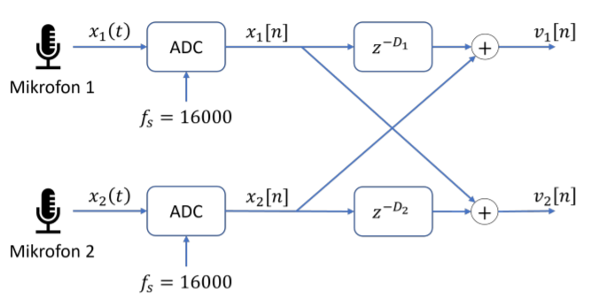

# Audio Beamforming and Speech Separation

Dual-microphone beamforming system that separates overlapping audio sources (a baby crying and a lecture) from a stereo recording using time-delay alignment, fractional delay filtering, and frequency-domain masking.

## Course Information

- **Course:** [AIS2201 - Signalbehandling](https://www.ntnu.edu/studies/courses/AIS2201)
- **Institution:** NTNU - Norwegian University of Science and Technology
- **Semester:** Spring 2022

## Overview

Given a stereo recording from two spatially separated microphones capturing a lecture and a crying baby simultaneously, this project implements a signal processing pipeline to isolate each source into separate audio files.

The approach uses three techniques in sequence:

1. **Integer-delay beamforming** - Aligns microphone signals using whole-sample delays (23 and 20 samples at 16 kHz) based on the physical distance between microphones and each source
2. **Fractional-delay refinement** - Improves alignment precision using windowed sinc interpolation (e.g., 23.32 samples instead of rounding to 23), applying a Hamming window to the sinc function
3. **Frequency-domain mask separation** - Computes FFT of both channels, builds a binary mask comparing magnitude at each frequency bin, and zeroes out bins dominated by the unwanted source before inverse FFT

The result is two separated mono WAV files: one with the baby audio, one with the lecture audio.



## Audio Demo

**Input: Mixed stereo recording (baby + lecture)**

https://github.com/user-attachments/assets/83efd32d-9e32-4fd8-8925-39ceb8bcffe2

**Output: Separated baby audio**

https://github.com/user-attachments/assets/2665fa98-6afd-43ae-b6a0-7ab2f7eb87f5

**Output: Separated lecture audio**

https://github.com/user-attachments/assets/1613d28e-265e-4b44-98cd-b3f248f4465f

> **Note:** To embed the audio players above, edit this README on GitHub and drag-drop the `.mp4` files from `audio/` into the text editor. GitHub will generate permanent upload URLs to replace the placeholders.

## Project Structure

```
.
├── notebooks/
│   ├── beamforming.ipynb          # Main implementation (well-commented)
│   └── beamforming_initial.ipynb  # Earlier development version
├── audio/
│   ├── input_stereo.wav           # Input: stereo lecture + baby (16 kHz)
│   ├── output_baby.wav            # Output: separated baby audio
│   ├── output_adult.wav           # Output: separated lecture audio
│   └── test_sources/              # Individual source recordings for testing
│       ├── adult(sn2).wav         # Adult speech source
│       ├── adult(sn2f).wav        # Adult speech (filtered)
│       ├── baby(sn1).wav          # Baby cry source
│       ├── baby(sn1f).wav         # Baby cry (filtered)
│       └── forelesningsopptak.wav # Lecture recording
├── arduino/
│   └── iir_filter/                # Real-time IIR filter on Arduino
│       ├── iir_filter.ino
│       ├── Filter.cpp / .h
│       └── SampleTimer.cpp / .h
├── docs/
│   └── diagrams/                  # Beamforming and geometry diagrams
├── requirements.txt
└── .gitignore
```

## Tech Stack

- **Python 3.8+** with Jupyter Notebook
- **NumPy** - FFT, signal manipulation, array operations
- **SciPy** - WAV file I/O, signal processing utilities
- **Matplotlib** - Spectrograms, waveform plots, frequency analysis
- **Arduino (C++)** - Real-time 3rd-order IIR digital filter (2 kHz sampling via MCP4911 DAC)

## How to Run

### Beamforming Notebook

```bash
pip install -r requirements.txt
cd notebooks
jupyter notebook beamforming.ipynb
```

Run all cells sequentially. The notebook reads `audio/input_stereo.wav` and produces separated output files.

### Arduino IIR Filter

The `arduino/iir_filter/` directory contains a standalone real-time digital filter implementation:

1. Upload `iir_filter.ino` to an Arduino with MCP4911 DAC connected via SPI
2. Feed analog signal to pin A0
3. Filtered output appears on DAC output

The filter implements a 3rd-order IIR transfer function at 2 kHz sampling rate.

## Key Concepts

- **Delay-and-sum beamforming** - Spatial filtering using time delays derived from microphone geometry
- **Fractional sample delay** - Sinc interpolation with Hamming windowing for sub-sample precision
- **Binary frequency masking** - Source separation by comparing per-bin magnitudes across channels
- **IIR filtering** - Recursive digital filter with feedback (denominator) coefficients
